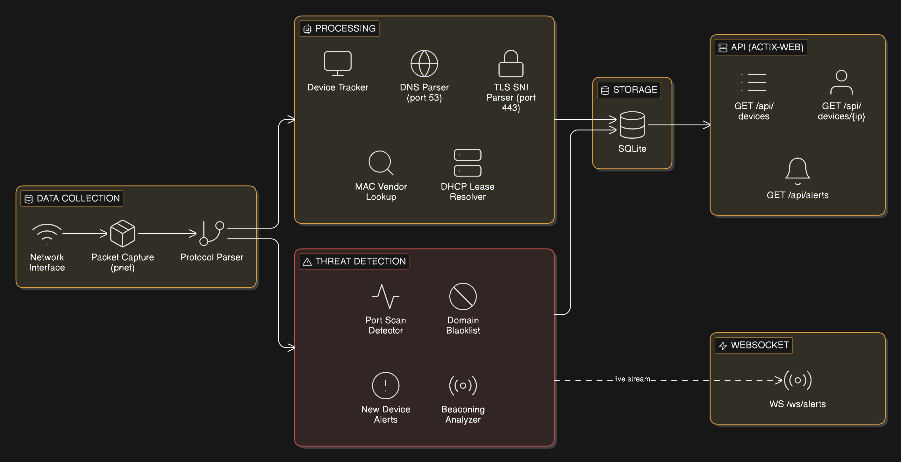

# netwatch

Network security monitor for Raspberry Pi. Captures raw packets, identifies devices, logs DNS/TLS traffic, detects threats in real-time.

Built from scratch in Rust including a hand-written TLS ClientHello parser for SNI extraction.

## Flowchart



## Features

- Raw packet capture via pnet (Ethernet → IPv4 → TCP/UDP)
- Device tracking by IP with MAC vendor identification (IEEE OUI)
- DNS query logging (port 53) and TLS SNI extraction (port 443)
- Hostname resolution from dnsmasq DHCP leases
- Threat detection: port scanning, domain blacklist, new device alerts, beaconing analysis
- REST API (actix-web) for device list, device detail, alerts
- WebSocket endpoint for real-time alert streaming
- SQLite persistence for devices, DNS logs, and alerts
- Automated cross-compilation and deployment to ARM

## API
```
GET /api/devices          — all tracked devices with domains
GET /api/devices/{ip}     — single device detail
GET /api/alerts           — threat detection alerts
WS  /ws/alerts            — live alert stream
```

## Deploy
```bash
./deploy.sh  # builds for aarch64, deploys to Pi, restarts service
```

## Requirements

- Raspberry Pi (tested on Pi 5)
- Pi configured as network DHCP/DNS server (dnsmasq)
- `cap_net_raw` capability or root for packet capture

## License

MIT
